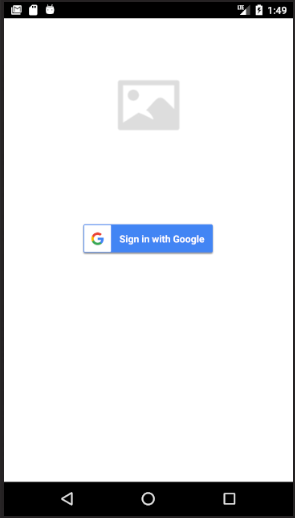
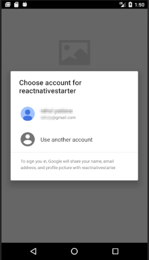
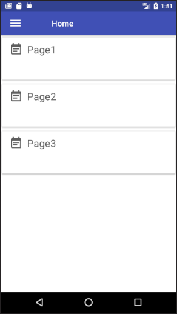
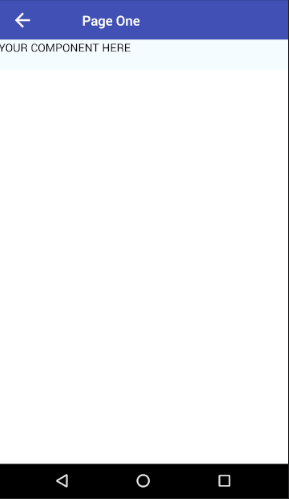
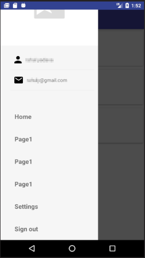

## Starter react-native app with google signin integration

This starter app allows access to inner app screens only after successful google signin. 








### Setup

```
npm install
```

```
react-native link
```

Create a Firebase project or use an existing project
[Firebase console](https://console.firebase.google.com/u/0/)

Go to project settings in Firebase.

Go to Add App section. Here you need to enter your app's 'Package name' and SHA-1 fingerprint

For android:
to get SHA-1 fingerprint [follow this](https://facebook.github.io/react-native/docs/signed-apk-android.html)

You can also use your debug keystore's SHA-1 hash
```
keytool -exportcert -keystore ~/.android/debug.keystore -list -v
```

This will print SHA1 fingerprint, paste it into firebase android app settings 

Download google-services.json file from Firebase and put it in ```<YOUR_PROJECT_ROOT>/android/app```

```
react-native run-android
```
